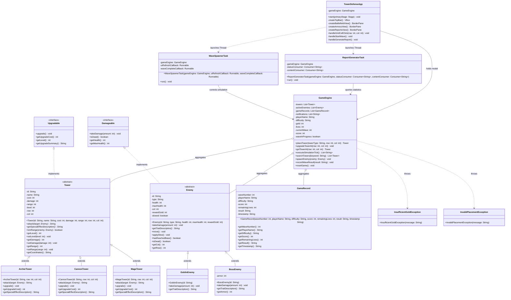

# UML Class Diagram

This diagram visualizes the object-oriented structure, class inheritance hierarchies, interface contracts, and relationships across the `td` package.

```mermaid
classDiagram
    direction TB

    %% Interfaces
    class Upgradable {
        <<interface>>
        +upgrade() void
        +getUpgradeCost() int
        +getLevel() int
        +getUpgradeSummary() String
    }

    class Damageable {
        <<interface>>
        +takeDamage(amount: int) void
        +isDead() boolean
        +getHealth() int
        +getMaxHealth() int
    }

    %% Abstract Base Classes
    class Tower {
        <<abstract>>
        -id: String
        -name: String
        -cost: int
        -damage: int
        -range: int
        -level: int
        -row: int
        -col: int
        +Tower(id: String, name: String, cost: int, damage: int, range: int, row: int, col: int)
        +attack(target: Enemy)* String
        +getSpecialEffectDescription()* String
        +isInRange(enemy: Enemy) boolean
        +getLevel() int
        +setLevel(level: int) void
        +getDamage() int
        +setDamage(damage: int) void
        +getRange() int
        +setRange(range: int) void
        +getCoordinates() String
    }

    class Enemy {
        <<abstract>>
        -id: String
        -type: String
        -health: int
        -maxHealth: int
        -col: int
        -rewardGold: int
        -slowed: boolean
        +Enemy(id: String, type: String, health: int, maxHealth: int, rewardGold: int)
        +takeDamage(amount: int)* void
        +getTraitDescription()* String
        +move() void
        +applySlow() void
        +hasReachedBase() boolean
        +isDead() boolean
        +getCol() int
        +getRow() int
    }

    %% Tower Concrete Subclasses
    class ArcherTower {
        +ArcherTower(id: String, row: int, col: int)
        +attack(target: Enemy) String
        +upgrade() void
        +getUpgradeCost() int
        +getSpecialEffectDescription() String
    }

    class CannonTower {
        +CannonTower(id: String, row: int, col: int)
        +attack(target: Enemy) String
        +upgrade() void
        +getUpgradeCost() int
        +getSpecialEffectDescription() String
    }

    class MageTower {
        +MageTower(id: String, row: int, col: int)
        +attack(target: Enemy) String
        +upgrade() void
        +getUpgradeCost() int
        +getSpecialEffectDescription() String
    }

    %% Enemy Concrete Subclasses
    class GoblinEnemy {
        +GoblinEnemy(id: String)
        +takeDamage(amount: int) void
        +getTraitDescription() String
    }

    class BossEnemy {
        -armor: int
        +BossEnemy(id: String)
        +takeDamage(amount: int) void
        +getTraitDescription() String
        +getArmor() int
    }

    %% Value Object Model
    class GameRecord {
        -waveNumber: int
        -playerName: String
        -difficulty: String
        -score: int
        -remainingLives: int
        -result: String
        -timestamp: String
        +GameRecord(waveNumber: int, playerName: String, difficulty: String, score: int, remainingLives: int, result: String, timestamp: String)
        +getWaveNumber() int
        +getPlayerName() String
        +getDifficulty() String
        +getScore() int
        +getRemainingLives() int
        +getResult() String
        +getTimestamp() String
    }

    %% Exceptions
    class InsufficientGoldException {
        +InsufficientGoldException(message: String)
    }

    class InvalidPlacementException {
        +InvalidPlacementException(message: String)
    }

    %% Engine Service
    class GameEngine {
        -towers: List~Tower~
        -activeEnemies: List~Enemy~
        -gameRecords: List~GameRecord~
        -notifications: List~String~
        -playerName: String
        -difficulty: String
        -gold: int
        -lives: int
        -currentWave: int
        -score: int
        -waveInProgress: boolean
        +placeTower(towerType: String, row: int, col: int) Tower
        +upgradeTowerAt(row: int, col: int) void
        +getTowerAt(row: int, col: int) Tower
        +executeSimulationTick() List~String~
        +searchTowers(keyword: String) List~Tower~
        +spawnEnemy(enemy: Enemy) void
        +recordWaveResult(result: String) void
        +resetGame() void
    }

    %% Background Thread Tasks
    class WaveSpawnerTask {
        -gameEngine: GameEngine
        -uiRefreshCallback: Runnable
        -waveCompleteCallback: Runnable
        +WaveSpawnerTask(gameEngine: GameEngine, uiRefreshCallback: Runnable, waveCompleteCallback: Runnable)
        +run() void
    }

    class ReportGeneratorTask {
        -gameEngine: GameEngine
        -statusConsumer: Consumer~String~
        -contentConsumer: Consumer~String~
        +ReportGeneratorTask(gameEngine: GameEngine, statusConsumer: Consumer~String~, contentConsumer: Consumer~String~)
        +run() void
    }

    %% JavaFX Application
    class TowerDefenseApp {
        -gameEngine: GameEngine
        +start(primaryStage: Stage) void
        -createTopBar() VBox
        -createBattlefieldView() BorderPane
        -createArmoryView() BorderPane
        -createReportsView() BorderPane
        -handleGridCellClick(row: int, col: int) void
        -handleStartWave() void
        -handleGenerateReport() void
    }

    %% Relationships & Realizations
    Upgradable <|.. Tower : implements
    Damageable <|.. Enemy : implements

    Tower <|-- ArcherTower : extends
    Tower <|-- CannonTower : extends
    Tower <|-- MageTower : extends

    Enemy <|-- GoblinEnemy : extends
    Enemy <|-- BossEnemy : extends

    GameEngine o-- Tower : aggregates
    GameEngine o-- Enemy : aggregates
    GameEngine o-- GameRecord : aggregates
    GameEngine ..> InsufficientGoldException : throws
    GameEngine ..> InvalidPlacementException : throws

    WaveSpawnerTask --> GameEngine : controls simulation
    ReportGeneratorTask --> GameEngine : queries statistics

    TowerDefenseApp --> GameEngine : holds model
    TowerDefenseApp ..> WaveSpawnerTask : launches Thread
    TowerDefenseApp ..> ReportGeneratorTask : launches Thread
```
